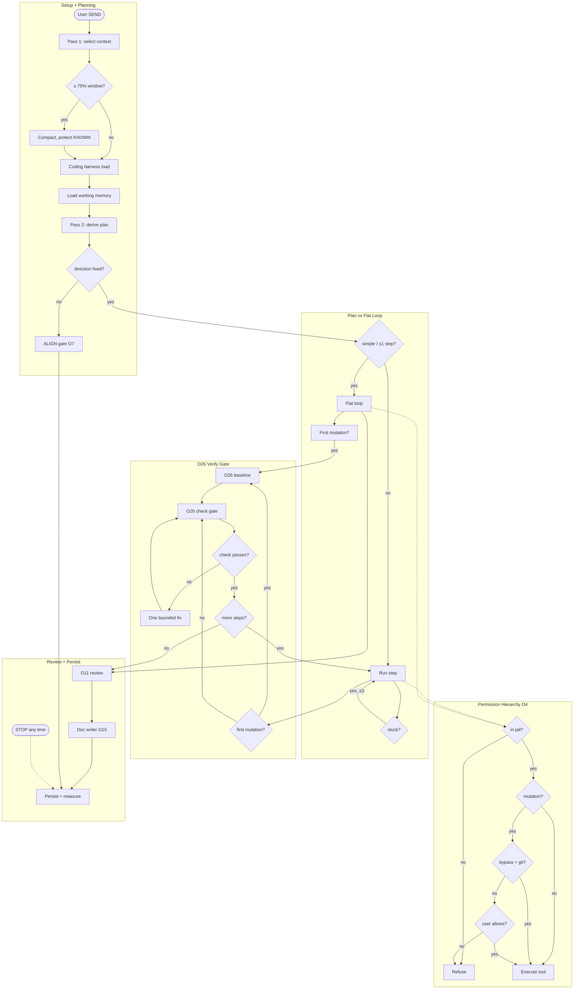

# Coding Harness Flowchart

```mermaid
flowchart TD
    subgraph SP [Setup + Planning]
        direction LR
        SEND(["User SEND"]) --> PASS1["Pass 1: select context"]
        PASS1 --> COMPACT{"≥ 75% window?"}
        COMPACT -- yes --> COMPACTED["Compact, protect KNOWN"]
        COMPACT -- no --> HARNESS
        COMPACTED --> HARNESS["Coding harness load"]
        HARNESS --> MEM["Load working memory"]
        MEM --> PASS2["Pass 2: derive plan"]
        PASS2 --> ALIGN{"direction fixed?"}
        ALIGN -- no --> DECIDE["ALIGN gate O7"]
    end

    subgraph EX [Plan vs Flat Loop]
        direction LR
        ALIGN -- yes --> SHAPE{"simple / ≤1 step?"}
        SHAPE -- yes --> FLAT["Flat loop"]
        SHAPE -- no --> STEP["Run step"]
        STEP --> STUCK{"stuck?"}
        STUCK -- yes, ≤3 --> STEP
        FLAT --> FBASE["First mutation?"]
    end

    subgraph VG [O26 Verify Gate]
        direction TB
        STEP --> BASE{"first mutation?"}
        FBASE -- yes --> O26B["O26 baseline"]
        BASE -- yes --> O26B
        BASE -- no --> O26G["O26 check gate"]
        O26B --> O26G
        O26G --> PASS{"check passes?"}
        PASS -- no --> FIX["One bounded fix"]
        FIX --> O26G
        PASS -- yes --> MORE{"more steps?"}
        MORE -- yes --> STEP
    end

    subgraph PERM [Permission Hierarchy O4]
        direction LR
        JAIL{"in jail?"}
        JAIL -- no --> REFUSE["Refuse"]
        JAIL -- yes --> MUT{"mutation?"}
        MUT -- no --> EXEC["Execute tool"]
        MUT -- yes --> BYP{"bypass + git?"}
        BYP -- yes --> EXEC
        BYP -- no --> PROMPT{"user allows?"}
        PROMPT -- yes --> EXEC
        PROMPT -- no --> REFUSE
    end

    subgraph RP [Review + Persist]
        direction LR
        MORE -- no --> REV["O11 review"]
        FLAT --> REV
        REV --> DOC["Doc writer O15"]
        DOC --> PERSIST["Persist + measure"]
        DECIDE --> PERSIST
        STOP(["STOP any time"]) -.-> PERSIST
    end

    STEP -.-> JAIL
    FLAT -.-> JAIL
```
