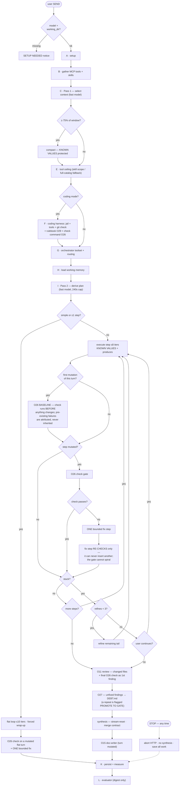
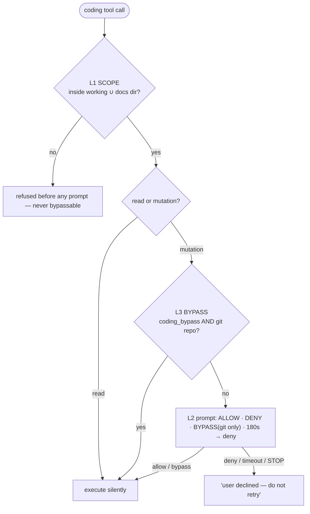

# Turn Pipeline — Pseudocode

The entire life of one turn, from SEND to persistence. Mirrors the real code:
`renderer.js → ipc.js (chat:send) → context-select.js / plan-derive.js →
execute.js | chat-loop.js → coding-tools.js / mcp/ → variables.js / compress.js`.
Sections marked `[PROPOSED]` are designed but not implemented.

## Flow diagram

> **Drawing from this diagram:** a model-generated redraw is a STOCHASTIC
> process — do not trust it to carry a specific fact. Measured 2026-08-14 over
> 14 controlled single-call redraws: whether the O26 baseline or the
> cannot-spiral property survived was **uncorrelated** with how it was encoded
> (sub-label, terse node, edge label, named node, or pure topology), with the
> node budget (18-24 vs 30), and with naming them as explicit MUST-KEEP
> requirements — the must-keep arm scored 0/3 against a 1/3 control. Roughly
> 1 redraw in 5 kept a given property, which is why an earlier 8-of-8 miss
> streak looked systematic and was not.
>
> The consequence: if a graphic MUST show something, verify it after
> generation and fix it by hand — the same "check it, don't trust it" rule
> O26 applies to code. The nodes below are written as stages because that is
> what they are, not because it makes them survive.





```
────────────────────────────────────────────────────────────────────────
RENDERER — submit()                                        (renderer.js)
────────────────────────────────────────────────────────────────────────
on SEND:
    require selected model AND project.working_dir     # missingPrereqs()
    persist user message; attachments → project documents
    subscribe chat:progress                            # live rail + INTERNALS + prompts
    invoke chat:send { text, history, providerId, model, projectId, chatId }

on chat:progress event:
    token          → stream into bubble
    limit / stuck  → CONTINUE-or-STOP prompt        (answers via chat:continue)
    action-approve → permission prompt              (see PERMISSION HIERARCHY)
    stream-reset   → clear streamed text            (synthesis replaces step text)
    process/*      → PLAN rail narration + INTERNALS lenses
on STOP button: send chat:abort

────────────────────────────────────────────────────────────────────────
MAIN — chat:send orchestrator                                   (ipc.js)
────────────────────────────────────────────────────────────────────────
A. SETUP
    connector   ← provider(providerId) + decrypted key       # secrets stay in main
    chosenModel ← chat model        # execution + synthesis
    fastModel   ← provider.fast    # ALL meta-calls: select, plan, compact, refine
    turnAbort   ← AbortController; isAborted() polled at every loop boundary

B. GATHER CAPABILITIES
    toolset ← mcp.buildToolset()            # namespaced <server>__<tool> + routes
    skills  ← enabledForProject, healed     # envelope → body/description/mcp_functions

C. PLAN PASS 1 — CONTEXT SELECTION                    (context-select.js, fastModel)
    {skillNames, toolNames} ← selectContext(menu of skill/tool one-liners)
                              # forced tool `select_context`; any failure → empty picks
    convo ← [system: skill menu + FULL instructions of selected skills] + history

D. COMPACTION                                                    (compress.js)
    if estTokens(convo) ≥ 75% of contextWindow(chosenModel):
        convo ← summary(older msgs, fastModel) + last 6 messages
                # `protect:` re-injects KNOWN VALUES verbatim — structurally
                # cannot be summarized away

E. TOOL CEILING                                            (deterministic)
    scopedTools ← selected tools ∩ skill-authored tools_json restriction
    if nothing usable → fall back to FULL catalog (never an arbitrary slice)

F. CODING HARNESS MODE                     (coding-tools.js — per-chat toggle)
    if chat.coding_mode AND project.working_dir:
        gitAvailable ← hasGit(working_dir)             # .git dir or worktree file
        jail  ← { working_dir (primary), documents_dir }
        coding ← buildCodingTools(jail, approveAction)
                 # read_file · list_dir · grep_files · write_file · edit_file · run_command
        scopedTools += coding.tools                    # planner sees them; never selected-away
        convo ← [system: CODING MODE note — roots, rules] + convo

    ── PERMISSION HIERARCHY (evaluated per tool call) ──────────────────
    LEVEL 1 · SCOPE — never bypassable
        every path must resolve inside working_dir ∪ documents_dir
        violation → refused BEFORE any prompt; shell cwd = working_dir
        (a shell is inherently unjailed → shell always sits at Level 2)
    LEVEL 2 · ACTION GATING
        reads (read_file/list_dir/grep_files)      → allowed silently
        mutations (write_file/edit_file/run_command):
            approveAction(kind, summary):
                if LEVEL 3 grants → allow
                else prompt user: ALLOW | DENY | BYPASS(git only)   # 180s → deny
                DENY → tool returns "user declined — do not retry"
    LEVEL 3 · BYPASS — requires rollback
        granted iff settings.coding_bypass == '1' AND gitAvailable
        enforced in MAIN (UI merely hides the button without git):
        no git repo → bypass ignored, always ask
    ─────────────────────────────────────────────────────────────────────

G. ORCHESTRATOR TOOLSET + ROUTING
    orchestratorTools ← [delegate, assign, save_document, set_variable] + scopedTools
    callTool(name, args):
        set_variable   → variable store write                 (never leaves main)
        save_document  → placement template → disk + index → path back
        delegate       → one isolated sub-agent → conclusion only
        assign         → parallel sub-agents → optional merge
        coding tool    → jail → approveAction → execute        (Stage F)
        else           → MCP route
        always: captureFromArgs/Result → variable store        # ids/locators only
                filterToolResult (ANSI/base64/dupes/24k cap)   # every rule → glass box

H. WORKING MEMORY                                            (variables.js)
    store ← chats.variables_json                # survives turns AND restarts
    entries: {key, value≤200ch, confidence: observed<derived<user, provenance}
    rendered as KNOWN VALUES block — re-injected at every step, protected in compaction

I. PLAN PASS 2 — STEP DERIVATION               (plan-derive.js, fastModel, 240s cap)
    narrate "deriving plan…"
    plan ← derivePlan(cheat_sheet, loaded skill instructions, tool menu+descriptions,
                      agent roster, KNOWN VALUES)
           # forced tool `submit_plan` →
           # { simple | goal, steps:[{task, produces, delegate, parallel}], merge }
    any failure or timeout → {simple:true}      # flat loop is ALWAYS the worst case

J. EXECUTION
    if plan.simple or steps ≤ 1:
        FLAT LOOP                                              (chat-loop.js)
            repeat ≤ 10: model → tool calls → results → model
            at cap: ask user CONTINUE(+10)/STOP → forced tool-less wrap-up
    else:
        PLAN-AND-EXECUTE                                        (execute.js)
            for each step:
                if step.parallel → sub-agent(KNOWN VALUES + task + produces contract)
                else executeStep:
                    directive = KNOWN VALUES + "CURRENT STEP: task"
                              + "MUST PRODUCE: … record via set_variable"
                    inner loop ≤ 8 iterations
                    budget exhausted → forced partial summary → STUCK
                between steps: compact(history, protect=KNOWN VALUES)
                STUCK → refinePlan(remaining tail) ≤ 3×
                      → then ESCALATE to user (explain; continue resets budget,
                        decline → synthesize partials)
            SYNTHESIS: stream-reset → one tool-less call over
                       goal + step digest + KNOWN VALUES, honoring plan.merge
                       # the synthesis IS the reply, not the step stream

    STOP at any point (turnAbort + boundary checks):
        kill in-flight HTTP · no synthesis call ·
        reply assembled from completed conclusions · ALL work persisted

K. PERSIST + MEASURE
    chats.variables_json ← store
    turn_metrics ← real usage, cache %, savings (filter/skill/compaction),
                   plan_steps, plan_refines, vars_captured, duration
    task_metrics ← per tool call / sub-agent / meta-call
    glass box    ← ledger (occupancy), tool trace, process events → INTERNALS

L. META-EVALUATION (optional, separate model)               (evaluator.js)
    digest (never raw content): mode, plan + step statuses, replans, vars, usage
    → findings classified usage | strategy | app
    # judges the CONTEXT ENGINEERING, not the answer

────────────────────────────────────────────────────────────────────────
WALKTHROUGH BY HAND — "Add a --verbose flag to cli.js and run the tests."
  (coding-mode chat · working_dir is a git repo · 12 MCP tools · 3 skills ·
   2 KNOWN VALUES from yesterday: test_command="npm test", entry_point="cli.js")
────────────────────────────────────────────────────────────────────────
A     chosenModel sonnet · fastModel haiku · abort wired
B     12 MCP tools · 3 skills healed
C     Pass 1 picks 0 skills / 0 MCP tools (coding ask) → menu only
D     6.1k / 200k window → no compaction
E     no usable picks → fellBack: full 12-tool catalog (recorded in metrics)
F     hasGit ✓ · jail = working ∪ docs · +6 coding tools · CODING MODE note
H     store loads 2 surviving entries
I     Pass 2 (38s) → 3 steps:
        1 locate arg parsing        produces: flag_location
        2 implement --verbose       produces: edited cli.js
        3 run tests, fix failures   produces: test_result
      merge: "Report the change made and the test outcome."
J·1   grep_files → read_file → set_variable flag_location   (reads free; 3/8 iters)
J·2   edit_file cli.js → L1 in-jail ✓ → L3 no bypass → L2 PROMPT
        user clicks BYPASS (GIT ROLLBACK) → coding_bypass persisted
      edit applied · verify read · done (2/8)
J·3   run_command "npm test" → L3 auto-approved (bypass ✓ git ✓) → exit 1
      edit_file test/help.test.js → run_command again → exit 0 · 14 passing
      set_variable test_result · done (5/8) · 0 stuck · 0 refines
SYN   stream-reset → sonnet writes THE reply per merge contract
K     4 variables persisted · plan_steps 3 · vars_captured 2 ·
      input 48.2k (64% cached) · 3m41s
L     evaluator: "usage — Pass 1 fell back to full MCP catalog; 12 offered,
      0 used. Consider disabling that server for coding chats."

────────────────────────────────────────────────────────────────────────
SHIPPED since first draft (see docs/HARNESS_OBJECTIVES.md for the spec)
────────────────────────────────────────────────────────────────────────
  · O5  approval prompts show the change: −/+ diff for edits, size facts
        for writes, verbatim command for shell
  · O7  ALIGN gate: Pass 2 may return `decisions` instead of steps —
        direction-setting requests end the turn awaiting the user
  · O8  `record`: user-stated decisions persist as user-confidence
        KNOWN VALUES (overwrite-protected, cross-turn)
  · O9  step-commits: a completed step that mutated the tree commits
        with its `produces` as the message — the plan IS the git history
  · O10 plan-shape contract in DERIVE_PROMPT (coding mode): verify step
        required for code-writing plans; capability boundary stated
        (planned code can never call MCP)
  · O26 framework check gate: per-project check_command (granted via the
        same main-side confirmation as the O4 bypass) runs LAZILY just
        before the turn's first mutation (baseline — pre-existing failures
        attributed, not inherited), after every mutating sequential step
        (one bounded fix step on failure; fix steps re-check, never
        re-insert; a step that ran the check itself is not re-run), once
        after any fan-out/delegated step (sub-agent traces are isolated, so
        the per-step gate is blind to them), and once on a mutated flat
        turn; the final verdict reaches synthesis, anchors the O11 review as
        a deterministic finding, sets the reply's honesty marker, and lands
        in DEBT
  · O27 debt ledger: DEBT.md joins the canonical doc set; unfixed review
        findings, unresolved check failures, and drift findings append —
        a repeated finding is flagged PROMOTE TO GATE
  · O28 test integrity stated in CODING_RULES, the CODING MODE note, and
        every check-gate fix prompt (the EG-1 guardrail rides O17)
  · O29 working-dir rulebook (AGENT_RULES.md ▸ docs/AGENT_RULES.md ▸
        AGENTS.md ▸ CLAUDE.md) injected into the CODING MODE note and Pass 2
        under the PROJECT RULEBOOK banner; depth-2 repo map already fed
        Pass 2 — plans name real files
  · O30 drift pass (drift.js, Overview → MAINTENANCE): read-only scan of
        recently modified sources vs rulebook + canonical docs; findings →
        DEBT; fixes are ordinary turns with ordinary gates

────────────────────────────────────────────────────────────────────────
[PROPOSED] — designed, not yet implemented
────────────────────────────────────────────────────────────────────────
  · O11 refinement loop: parallel critic agents (security, coupling,
        efficiency, redundancy) + deterministic anchors, ≤2 cycles
  · O13 auto checkpoint before a bypassed turn's first mutation
    → shadow ref on turn_metrics → one-click "revert this turn"
  · read_skill_file — serve bundled skill files from skills.definition
  · evaluator code lens: diff summary in the digest when a turn mutated files
  · evaluator findings feed the DEBT ledger (O27 deferred half)
  · scheduled drift pass (O30 is user-invoked today)
  · sub-agent mutation traces surfaced to the O11 review + doc-writer —
    today a turn whose file changes happen ONLY inside delegated steps is
    reviewed and documented blind (the O26 check gate covers it; the
    file-level lenses do not). Rides the O13 checkpoint work, which gives
    the turn-start ref needed to diff what sub-agents actually changed
```
